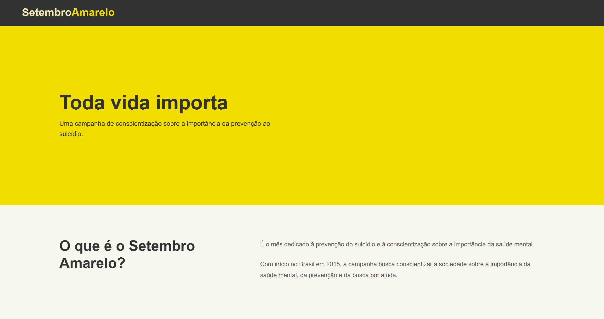

# setembro_amarelo

Projeto de uma página web informativa sobre o **Setembro Amarelo**, desenvolvido como atividade prática para estudo e aplicação de conceitos de desenvolvimento web.

A página tem como objetivo apresentar informações sobre a campanha, promover a conscientização sobre a valorização da vida e incentivar a busca por ajuda e apoio.

# 📸 Print da página

<h3 align="center">
   
     
   <b>Página informativa desenvolvida com HTML, CSS e JavaScript.</b>
     
</h3>

## Índice

* [Sobre](#sobre)
* [Tecnologias Utilizadas](#tecnologias-utilizadas)
* [Como Usar](#como-usar)

 

## Sobre

O projeto consiste em uma página web informativa sobre o **Setembro Amarelo**, abordando o significado da campanha, sua importância e informações relacionadas à conscientização e prevenção.

A página foi desenvolvida com uma estrutura simples e organizada, buscando proporcionar uma navegação intuitiva e um visual agradável.

O projeto foi criado principalmente para praticar conceitos de **HTML e CSS**, contando também com um pequeno recurso em **JavaScript** para complementar a interação da página.

 

## Tecnologias Utilizadas

O projeto foi desenvolvido utilizando:

* **HTML5** — estrutura e organização do conteúdo;
* **CSS3** — estilização, cores, espaçamentos e layout;
* **JavaScript** — utilizado em um pequeno recurso de interação da página.

 

## Como Usar

Para visualizar o projeto localmente:

1. Baixe ou clone este repositório;
2. Abra a pasta do projeto;
3. Abra o arquivo `index.html` em um navegador.

Também é possível utilizar o **Visual Studio Code** para editar os arquivos e acompanhar as alterações durante o desenvolvimento.

 

<h4 align="center">
    Feito com 💛 por <a href="https://github.com/aliciaeko" target="_blank">Alícia Eko</a>
</h4>
